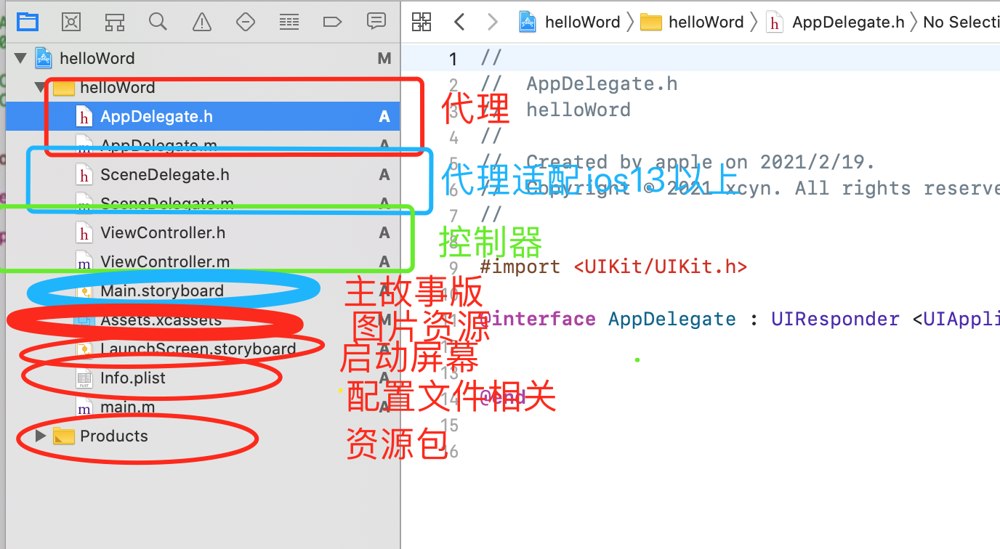

## 快捷键 
  + command + shift + n
## 选项说明
  + product Name: 应用程序的名称
  + Team: Team账号
  + Organization Name: 公司的名称：会在代码注释部分显示
  + Organization Identifier: 应用的标识符(com.xxx)
  + Bundle Identifier: 根据Organization Identifier自动生成
  + Language: 开发使用的语言
  + Use Core Data: 是否缓存界面
  + Include Unit Tests: 是否包含单元测试
  + Include UI Tests: 是否包含ui测试
## 初始化项目文件说明
  + 
## 应用程序启动过程 （实例：./hello-word/test.storyboard）
  + 1、加载一个storyboard(Main interface) && info.plist storyboardName也需要改成对应的storyboard控制器
  + 2、加载箭头所指向的控制器
  + 3、加载控制器中的view(显示到用户面前)
## oc基础知识讲解
  ### 在Objective里完成的文件被称为界面文件，该类文件的定义被称为实现文件。
    + 基础语法: https://www.runoob.com/ios/ios-objective-c.html
## 简单的tab切换案例记录
  + 快捷键记录
    + storyboard 组件库快捷键 command + shift + L
  + 新建controller
    + 新建file -> source -> Cocoa Touch Class
    + sb界面下 -> show the identity inspector
  + IBAction 和 IBOutlet
    + IBAction
    + 从返回值角度看，作用相当于void
    + 只有返回值为IBAction的方法才能和sb中的控件连线
    + IBOutlet
    + 只有声明为IBOutlet的属性，才能跟storyboard中的控件连线
  + @property
    + 语法: https://www.cnblogs.com/szvichard/p/11118459.html
    ```
      @property (nonatomic, weak)IBOutlet UILabel *label;
    ```
  + UILabel常用属性
    ```
          -(IBAction)clickRedBtn{
      //    字体颜色
          self.label.textColor = [UIColor whiteColor];
      //    按钮文字
          self.label.text = @"红色按钮";
      //    按钮大小
          self.label.font = [UIFont systemFontOfSize: 20.0];
      //    对齐方式
          self.label.textAlignment = NSTextAlignmentCenter;
      //    背景色
          self.label.backgroundColor = [UIColor redColor];
      }
    ```
  + 问题记录
    + .h 和 .m 文件中的同一个@interface有何区别？
    + https://blog.csdn.net/qq_37310110/article/details/80975507

